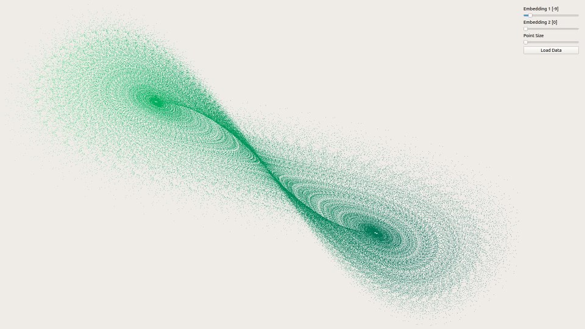
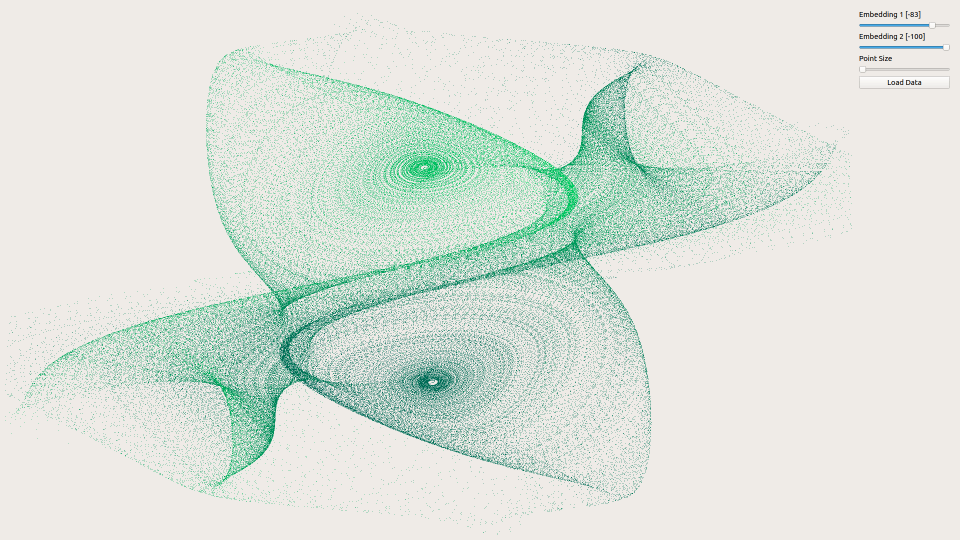
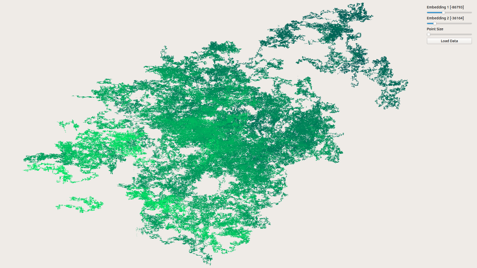
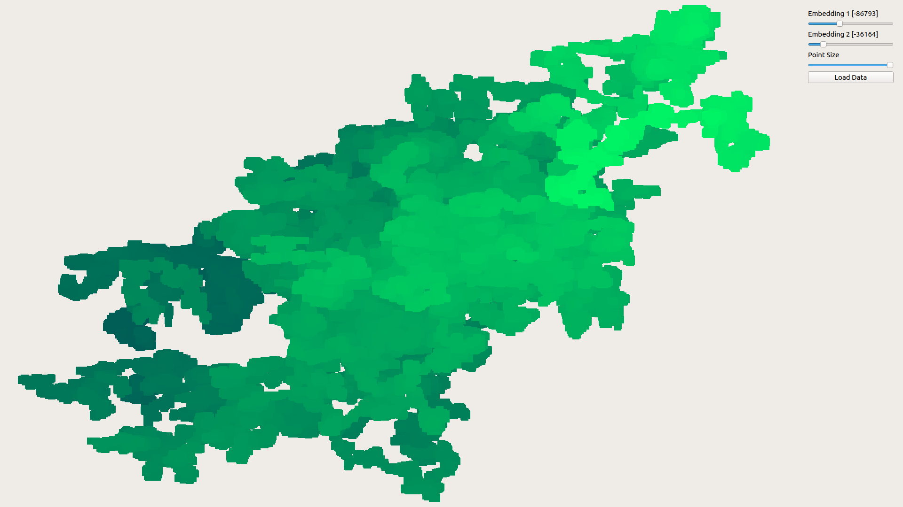

# DCE Viewer

Perform fast interactive visualizations of Delay Coordinate Embeddings on the GPU.
Very much work in progress but works as intended.

# Run

```bash
python3 main.py
```

# Requirements

 - NumPy
 - Pandas
 - PyQt5
 - PyOpenGL
 - Python 3.6
 
```bash
pip3 install numpy pandas pyqt5 pyopengl
```

# Examples




